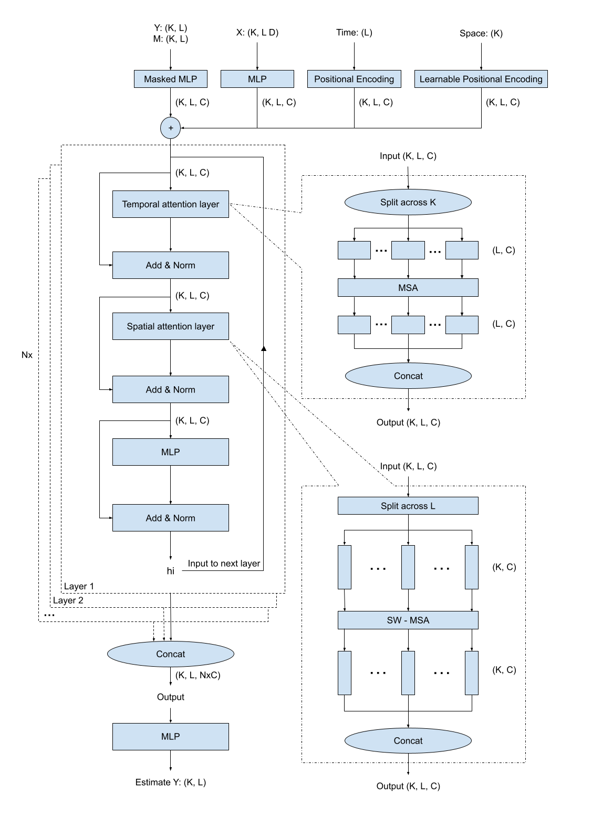
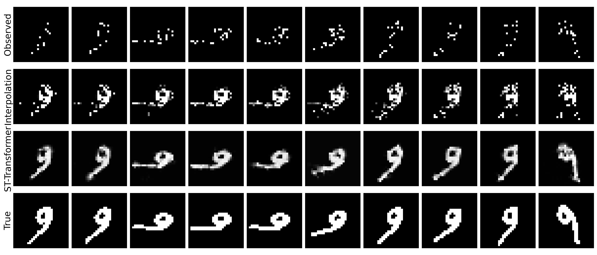

# A Deep Learning Approach for Imputing Sparse Spatiotemporal Data

This repository contains the code for the reproducibility of the experiments presented in the paper "A Deep Learning Approach for Imputing Sparse Spatiotemporal Data".

**Authors**: [Kehui Yao](https://stat.wisc.edu/staff/yao-kehui/)

## ST-Transformer
The architecture of the ST-Transformer is depicted in the following figure. The model consists of three main components: an input encoder, a spatiotemporal transformer encoder, and an output layer.

## Experimental Results
Results on HealingMnist:

| Method            | MSE                |
|-------------------|--------------------|
| **ST-Transformer**| 0.054 +/- 0.000    |
| GP-VAE            | 0.114 +/- 0.002    |
| Interpolation     | 0.135 +/- 0.002    |
| Mean              | 0.210 +/- 0.004    |

